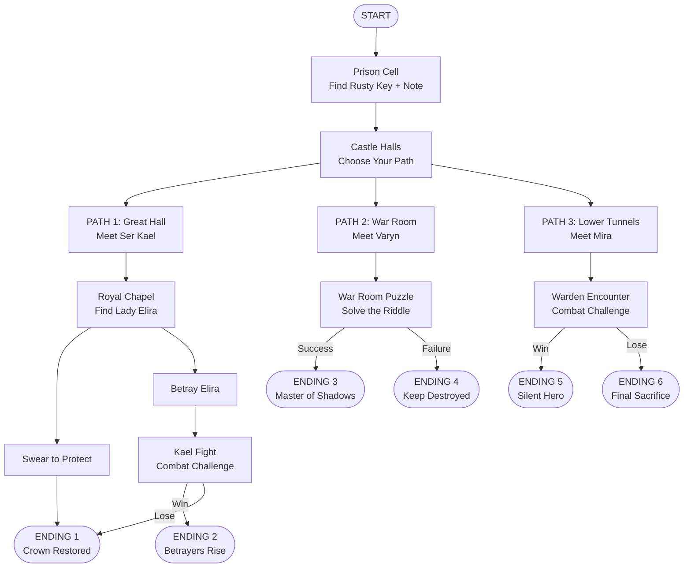

# Thrones of Ashfall — Story Flowchart

```mermaid
flowchart TD
    A([START]) --> B[Prison Cell<br/>Find Rusty Key + Note]
    B --> C[Castle Halls<br/>Choose Your Path]

    C --> D[PATH 1: Great Hall<br/>Meet Ser Kael]
    C --> E[PATH 2: War Room<br/>Meet Varyn]
    C --> F[PATH 3: Lower Tunnels<br/>Meet Mira]

    D --> G[Royal Chapel<br/>Find Lady Elira]
    G --> H[Swear to Protect]
    G --> I[Betray Elira]

    H --> END1([ENDING 1<br/>Crown Restored])
    I --> J[Kael Fight<br/>Combat Challenge]
    J --> |Win| END2([ENDING 2<br/>Betrayers Rise])
    J --> |Lose| END1

    E --> K[War Room Puzzle<br/>Solve the Riddle]
    K --> |Success| END3([ENDING 3<br/>Master of Shadows])
    K --> |Failure| END4([ENDING 4<br/>Keep Destroyed])

    F --> L[Warden Encounter<br/>Combat Challenge]
    L --> |Win| END5([ENDING 5<br/>Silent Hero])
    L --> |Lose| END6([ENDING 6<br/>Final Sacrifice])
```
